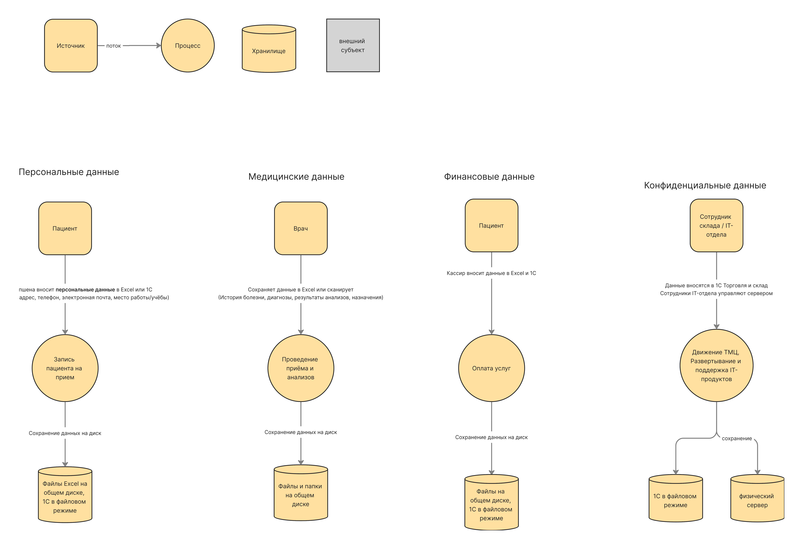

## Категории данных и их движение

| Категория данных                         | Источники данных              | Процессы                                             | Хранилища данных                                 | Обработка данных                                                               |
|------------------------------------------|-------------------------------|------------------------------------------------------|--------------------------------------------------|--------------------------------------------------------------------------------|
| **Персональные данные (PII)**            | Пациент предоставляет лично   | Запись пациента на приём                             | Файлы Excel на общем диске, 1С в файловом режиме | Сотрудники ресепшена вносят данные в Excel или 1С                              |
| **Медицинские данные (PHI)**             | Врач и сторонняя лаборатория  | Проведение приёма и анализов                         | Файлы и папки на общем диске                     | Данные сохраняются в Excel или сканируются                                     |
| **Финансовые данные (FIN)**              | Пациент производит оплату     | Оплата услуг                                         | Файлы на общем диске, 1С в файловом режиме       | Кассир вносит данные в Excel и 1С                                              |
| **Конфиденциальные бизнес-данные (CBI)** | Сотрудники склада и IT-отдела | Движение ТМЦ, развертывание и поддержка IT-продуктов | 1С в файловом режиме, физический сервер          | Данные вносятся в 1С Торговля и склад, сотрудники IT-отдела управляют сервером |

