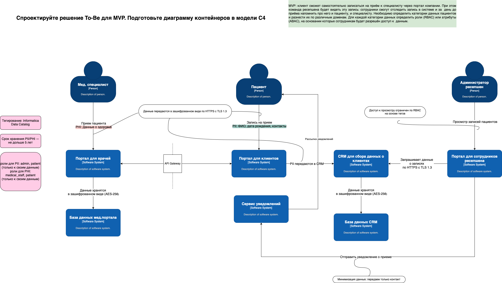

# Диаграмма ToBe

## Категории данных по доменам

| Категория данных             | Примеры                                      | Домены              | Уровень защиты |
|------------------------------|----------------------------------------------|---------------------|----------------|
| Идентифицирующие (PII)       | ФИО, дата рождения, номер паспорта, контакты | Портал для клиентов | Высокий        |
| Медицинские данные (PHI)     | Диагноз, результаты анализов                 | Портал для врачей   | Очень высокий  |
| Финансовые                   | Данные платежей, карта                       | Платёжный шлюз      | Высокий        |
| Аудит действия пользователей | Входы, доступ к данным                       | Система аудита      | Средний        |

## Нефункциональные требования (НФТ)

| Требование            | Реализация                                                       |
|-----------------------|------------------------------------------------------------------|
| **Безопасность**      | RBAC/ABAC, шифрование                                            |
| **Масштабируемость**  | Микросервисы, k8s, горизонтальное масштабирование                |
| **Сопровождаемость**  | CI/CD (например, GitHub Actions + ArgoCD)                        |
| **Конфигурируемость** | YAML/JSON-конфиги, UI для настройки бизнес-правил, feature flags |
